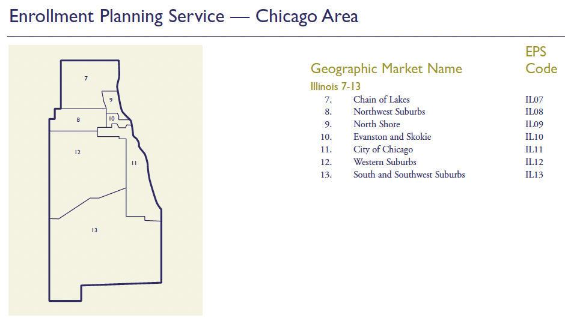

# Introduction

```{r setup, include=FALSE}
library(tidyverse)
library(kableExtra)
knitr::opts_chunk$set(echo = FALSE, message = FALSE, warning = FALSE)
```


### __Motivation__

> The hierarchical structure of collegiate competition largely reflects the stratified social and economic dimensions of the communities from which colleges draw their students. Competition among colleges, as admissions officers have told us for so long, is in fact, a matter of keeping company with one's peers. — *The Structure of College Choice* (Zemsky & Oedel, 1983)

Social closure: status groups restrict access to resources that confer privilege

- Selective colleges are site of closure
  - Privileged groups redefine admissions criteria to benefit themselves

But colleges don't passively accept applicants; they recruit

- If recruiting markets constructed by shared infrastructures
- Then social closure operates upstream of admissions

::: {style="margin-top:1.0em;"}
:::

**College Board Geomarkets structure recruiting visits by selective colleges, concentrating visits in affluent communities**


### __Sociology of Education__
#### __How are students sorted into colleges?__

- *Annual Review of Sociology* [@RN2190; @RN4873; @RN2377; @RN5113].

  - <span style="color:#B3B3B3;">Households: status attainment, cultural capital</span>
  - <span style="color:#B3B3B3;">Schools: "sorting machines" that assign categories (e.g., tracks)</span>
  - Colleges
      - Selective admissions: which admissions criteria to ration scarce seats

::: {style="margin-top:1.0em;"}
:::

- Enrollment economy [@RN2401] and enrollment management [@RN3519]
    - High school recruiting visits [@RN4758]

::: {style="margin-top:1.0em;"}
:::

- "Supply-side" research thinks colleges are doing the sorting
- Third-party intermediaries
  - Consumer-facing intermediaries (e.g., rankings) discipline consumers and colleges [@RN5003; @RN5065]
  - Business-facing intermediaries sort students on behalf of colleges

### **Case**
#### **The Structure of College Choice [@RN4982]**

Project goal: "capture and quantify" (p. 11) knowledge of admissions officers

::: {style="margin-top:1.0em;"}
:::


Creates three geographic levels: region, state, community (Geomarket)

- Geomarkets carve states and metro areas into smaller geographic regions

::: {style="margin-top:1.0em;"}
:::

Create 4 student "market segments" based on SAT score-sending behavior

- local, in-state, regional, national
- local: send most scores to colleges within Geomarket
- regional: send most scores out-of-state but in-region (e.g., Midwest)

::: {style="margin-top:1.0em;"}
:::

Market Segment Model predicts how demand for a college varies by Geomarket

- Student market segment mostly a function of class
- Selective colleges primarily enroll "regional" and "national" students
- Most "regional" and "national" students are located in affluent Geomarkets
- Selective colleges should focus recruiting on affluent Geomarkets
  
### Geomarkets around Chicago-land {.hide}

::: columns
::: {.column width="50%"}



<!--  -->
:::

::: {.column width="50%"}
**[University of Chicago admissions counselors, IL territories](https://collegeadmissions.uchicago.edu/contact)**

:::
:::


### __Theory__
#### __Market devices and classification situations__

__Market devices literature__ [@callon1998embeddedness; @RN5064]

- **Market devices**: tools that calculate/classify, then get incorporated in products
  - Geomarkets: defines recruiting territories
  - Market Segment Model: theory is abstract idea, until embedded in a device
    - Enrollment Planning Service (EPS) software

- **Agencement**: devices + org roles/goals produce menu of possible/likely actions  
  - Colleges commensurate Geomarkets based on market segments, SES, scores

- **Performativity**: Usage of devices produce behavior consistent with theory
  - Here: colleges use Geomarkets + related devices to produce recruiting behavior consistent with Market Segment Model

__Classification Situations__ [@RN4810; @RN5015]

- Ordinally ranked consumers matched to ordinally ranked products
- Market Segment Model: ordinally ranked student segments (local, in-state, regional, national) matched to ordinally ranked colleges


### __Theory__ {.hide}
#### __Research questions and expectations__

**RQ1**: Are visit patterns consistent with Market Segment Model recommendations?

- Expectation: For selective privates and most publics in sample, Market Segment Model recommends focusing on affluent Geomarkets in regions where many students likely to consider a college like yours

**RQ2**: Do Geomarkets (X) explain which high schools receive recruiting visits (Y)

- Geomarkets embedded in org + tech infrastructure that produces visits
  - Colleges assign admissions officers to Geomarkets ([LinkedIn profiles](#){data-modal-type="image" data-modal-url="./assets/images/strong_island_geomarkets_linkedin.png"})
  - Geomarkets + Market Segment Model basis for [Enrollment Planning Service](#){data-modal-type="image" data-modal-url="./assets/images/eps_landing_page.png"}
    - Identifies Geomarkets with high demand for peer/competitor colleges
  - Geomarkets integrated into [Slate/Oracle CRM software](#){data-modal-type="image" data-modal-url="./assets/images/slate_geomarket_shot.png"}

**RQ3**: Does Geomarket popularity (number of visits per school) mediate relationship between school composition (SES/race) and probability of a receiving a visit?

- Classification situations seek "good matches" between consumers and products
- A wealthy school in a wealthy Geomarket is a good match

# Methods

### __Data and sample__

Data collection [@RN4758]

- 2017 off-campus recruiting visits scraped from univ admissions websites

Data collection sample

- Public "research-extensive" universities from 2000 Carnegie (N=102)
- Private universities in top 100 of U.S. News *National Universities* (N=57)
- Private colleges in top 50 of *National Liberal Arts Colleges* (N=47)

Analysis sample: colleges that posted complete recruiting visits on website

- 16 public research, 14 private universities, 12 private liberal arts (omitted)

Constructing Geomarkets

- Assign Census tracts to Geomarkets by spatial overlay of @RN4988


Secondary data

- IPEDS; CCD; Private School Survey; Niche *Best Public/Private High Schools*

# Results

## RQ1

### __RQ1: Do visit patterns match Market Segment Model?__ {.hide}
#### __Freshman enrollment by residency status (in-state, out-of-state, international)__

```{r fig-enrollment-bar-residency-appendix, echo=FALSE, results="asis", message=FALSE, warning=FALSE}
pdf_in  <- "results/enrollment_bar_residency_appendix.pdf"
png_out <- "results/enrollment_bar_residency_appendix.png"
if (!file.exists(png_out) || file.info(png_out)$mtime < file.info(pdf_in)$mtime) {
  if (!requireNamespace("magick", quietly = TRUE)) {
    stop("Install 'magick': install.packages('magick')")
  }
  img <- magick::image_read_pdf(pdf_in, density = 220)
  magick::image_write(img, path = png_out, format = "png")
}
cat(sprintf(
  '<p style="text-align:center;"></p>',
  png_out
))
```

### __RQ1: Do visit patterns match Market Segment Model?__ {.hide}
#### __Recruiting visits by market segment__

```{r fig-recruiting-heatmap-market-appendix, echo=FALSE, results="asis", message=FALSE, warning=FALSE}
pdf_in  <- "results/recruiting_heatmap_market_appendix.pdf"
png_out <- "results/recruiting_heatmap_market_appendix.png"
if (!file.exists(png_out) || file.info(png_out)$mtime < file.info(pdf_in)$mtime) {
  if (!requireNamespace("magick", quietly = TRUE)) {
    stop("Install 'magick': install.packages('magick')")
  }
  img <- magick::image_read_pdf(pdf_in, density = 220)
  magick::image_write(img, path = png_out, format = "png")
}
cat(sprintf(
  '<p style="text-align:center;"></p>',
  png_out
))
```

### __RQ1: Do visit patterns match Market Segment Model?__ {.hide}
#### __Recruiting visits and freshman enrollment by market segment__

```{r fig-recruiting-enrollment-market-combined, echo=FALSE, results="asis", message=FALSE, warning=FALSE}
pdf_in  <- "results/recruiting_enrollment_market_combined.pdf"
png_out <- "results/recruiting_enrollment_market_combined.png"
if (!file.exists(png_out) || file.info(png_out)$mtime < file.info(pdf_in)$mtime) {
  if (!requireNamespace("magick", quietly = TRUE)) {
    stop("Install 'magick': install.packages('magick')")
  }
  img <- magick::image_read_pdf(pdf_in, density = 220)
  magick::image_write(img, path = png_out, format = "png")
}
cat(sprintf(
  '<p style="text-align:center;"></p>',
  png_out
))
```

### __RQ1: Do visit patterns match Market Segment Model?__ {.hide}
#### __Recruiting visits by EPS region__

```{r fig-recruiting-region-only, echo=FALSE, results="asis", message=FALSE, warning=FALSE}
pdf_in  <- "results/recruiting_heatmap_region_appendix.pdf"
png_out <- "results/recruiting_heatmap_region_appendix.png"
if (!file.exists(png_out) || file.info(png_out)$mtime < file.info(pdf_in)$mtime) {
  if (!requireNamespace("magick", quietly = TRUE)) {
    stop("Install 'magick': install.packages('magick')")
  }
  img <- magick::image_read_pdf(pdf_in, density = 220)
  magick::image_write(img, path = png_out, format = "png")
}
cat(sprintf(
  '<p style="text-align:center; margin-top:0.2em;"></p>',
  png_out
))
```

### __RQ1: Do visit patterns match Market Segment Model?__ {.hide}
#### __Recruiting visits and freshman enrollment by EPS region__

```{r fig-recruiting-enrollment-region-combined, echo=FALSE, results="asis", message=FALSE, warning=FALSE}
pdf_in  <- "results/recruiting_enrollment_region_combined.pdf"
png_out <- "results/recruiting_enrollment_region_combined.png"
if (!file.exists(png_out) || file.info(png_out)$mtime < file.info(pdf_in)$mtime) {
  if (!requireNamespace("magick", quietly = TRUE)) {
    stop("Install 'magick': install.packages('magick')")
  }
  img <- magick::image_read_pdf(pdf_in, density = 220)
  magick::image_write(img, path = png_out, format = "png")
}
cat(sprintf(
  '<p style="text-align:center;"></p>',
  png_out
))
```

### __RQ1: Do visit patterns match Market Segment Model?__ {.hide}
#### __Top 30 Geomarkets ranked by visits per school (public schools)__
```{r top30-pub, echo=FALSE, message=FALSE, warning=FALSE}
readRDS("results/top30_geo_pub_sch.RDS") %>%
  kableExtra::kbl(
    digits  = 1,
    caption = NULL,
    align   = c("r", "l", rep("r", ncol(.) - 2))
  ) %>%
  kableExtra::kable_classic(full_width = TRUE) %>%
  kableExtra::kable_styling(font_size = 16) %>%
  kableExtra::scroll_box(height = "82vh", width = "100%")
```

### __RQ1: Do visit patterns match Market Segment Model?__ {.hide}
#### __Top 30 Geomarkets ranked by visits per school (private schools)__
```{r top30-priv, echo=FALSE, message=FALSE, warning=FALSE}
readRDS("results/top30_geo_priv_sch.RDS") %>%
  kableExtra::kbl(
    digits  = 1,
    caption = NULL,
    align   = c("r", "l", rep("r", ncol(.) - 2))
  ) %>%
  kableExtra::kable_classic(full_width = TRUE) %>%
  kableExtra::kable_styling(font_size = 16) %>%
  kableExtra::scroll_box(height = "82vh", width = "100%")
```

### __RQ1: Do visit patterns match Market Segment Model?__ {.hide}
#### __Top 30 Geomarkets ranked by visits per school (public schools, national market segment)__
```{r top30-pub-national, echo=FALSE, message=FALSE, warning=FALSE}
readRDS("results/top30_geo_pub_sch_national.RDS") %>%
  kableExtra::kbl(
    digits  = 1,
    caption = NULL,
    align   = c("r", "l", rep("r", ncol(.) - 2))
  ) %>%
  kableExtra::kable_classic(full_width = TRUE) %>%
  kableExtra::kable_styling(font_size = 16) %>%
  kableExtra::scroll_box(height = "82vh", width = "100%")
```

### __RQ1: Do visit patterns match Market Segment Model?__ {.hide}
#### __Top 30 Geomarkets ranked by visits per school (private schools, national market segment)__
```{r top30-priv-national, echo=FALSE, message=FALSE, warning=FALSE}
readRDS("results/top30_geo_priv_sch_national.RDS") %>%
  kableExtra::kbl(
    digits  = 1,
    caption = NULL,
    align   = c("r", "l", rep("r", ncol(.) - 2))
  ) %>%
  kableExtra::kable_classic(full_width = TRUE) %>%
  kableExtra::kable_styling(font_size = 16) %>%
  kableExtra::scroll_box(height = "82vh", width = "100%")
```

### __RQ1: Do visit patterns match Market Segment Model?__ {.hide}
#### __Top 30 Geomarkets ranked by visits per 1,000 12th graders (public schools)__
```{r top30-pub-g12k, echo=FALSE, message=FALSE, warning=FALSE}
readRDS("results/top30_geo_pub_g12k.RDS") %>%
  kableExtra::kbl(
    digits  = 1,
    caption = NULL,
    align   = c("r", "l", rep("r", ncol(.) - 2))
  ) %>%
  kableExtra::kable_classic(full_width = TRUE) %>%
  kableExtra::kable_styling(font_size = 16) %>%
  kableExtra::scroll_box(height = "82vh", width = "100%")
```

### __RQ1: Do visit patterns match Market Segment Model?__ {.hide}
#### __Top 30 Geomarkets ranked by visits 1,000 12th graders (private schools)__
```{r top30-priv-g12k, echo=FALSE, message=FALSE, warning=FALSE}
readRDS("results/top30_geo_priv_g12k.RDS") %>%
  kableExtra::kbl(
    digits  = 1,
    caption = NULL,
    align   = c("r", "l", rep("r", ncol(.) - 2))
  ) %>%
  kableExtra::kable_classic(full_width = TRUE) %>%
  kableExtra::kable_styling(font_size = 16) %>%
  kableExtra::scroll_box(height = "82vh", width = "100%")
```

### __RQ1: Do visit patterns match Market Segment Model?__ {.hide}
#### __Top 30 Geomarkets ranked by visits per 1,000 12th graders (public schools, national market)__
```{r top30-pub-g12k-national, echo=FALSE, message=FALSE, warning=FALSE}
readRDS("results/top30_geo_pub_national_g12k.RDS") %>%
  kableExtra::kbl(
    digits  = 1,
    caption = NULL,
    align   = c("r", "l", rep("r", ncol(.) - 2))
  ) %>%
  kableExtra::kable_classic(full_width = TRUE) %>%
  kableExtra::kable_styling(font_size = 16) %>%
  kableExtra::scroll_box(height = "82vh", width = "100%")
```

### __RQ1: Do visit patterns match Market Segment Model?__ {.hide}
#### __Top 30 Geomarkets ranked by visits 1,000 12th graders (private schools, national market)__
```{r top30-priv-g12k-national, echo=FALSE, message=FALSE, warning=FALSE}
readRDS("results/top30_geo_priv_national_g12k.RDS") %>%
  kableExtra::kbl(
    digits  = 1,
    caption = NULL,
    align   = c("r", "l", rep("r", ncol(.) - 2))
  ) %>%
  kableExtra::kable_classic(full_width = TRUE) %>%
  kableExtra::kable_styling(font_size = 16) %>%
  kableExtra::scroll_box(height = "82vh", width = "100%")
```

### __RQ1: Do visit patterns match Market Segment Model?__ {.hide}
#### __Concentration of recruiting visits by Geomarket affluence__

```{r fig-concentration, echo=FALSE, results="asis", message=FALSE, warning=FALSE}
pdf_in  <- "results/concentration_all_visits.pdf"
png_out <- "results/concentration_all_visits.png"

if (!file.exists(png_out) || file.info(png_out)$mtime < file.info(pdf_in)$mtime) {
  if (!requireNamespace("magick", quietly = TRUE)) {
    stop("Install 'magick': install.packages('magick')")
  }
  img <- magick::image_read_pdf(pdf_in, density = 220)
  magick::image_write(img, path = png_out, format = "png")
}

cat(sprintf(
  '<p style="text-align:center; margin:0; padding:0;"></p>',
  png_out
))
```

### __RQ1: Do visit patterns match Market Segment Model?__ {.hide}
#### __Concentration of recruiting visits by Geomarket affluence, by college type and market segment__

```{r fig-concentration-3x2, echo=FALSE, results="asis", message=FALSE, warning=FALSE}
pdf_in  <- "results/concentration_3x3.pdf"
png_out <- "results/concentration_3x3.png"

if (!file.exists(png_out) || file.info(png_out)$mtime < file.info(pdf_in)$mtime) {
  if (!requireNamespace("magick", quietly = TRUE)) {
    stop("Install 'magick': install.packages('magick')")
  }
  img <- magick::image_read_pdf(pdf_in, density = 220)
  magick::image_write(img, path = png_out, format = "png")
}

cat(sprintf(
  '<p style="text-align:center; margin:0; padding:0;"></p>',
  png_out
))
```


## RQ2

```{r rq2-table-functions, echo=FALSE, include=FALSE}

make_rq2_fit_table <- function(tab_df) {
  
  fit_rows_num <- c(
    "N schools",
    "N (schools X colleges)",
    "Parameters (incl. FE)",
    "Residual df",
    "R²",
    "Adj. R²",
    "Within R²",
    "RMSE"
  )
  
  fmt_int_rows <- c(
    "N schools",
    "N (schools X colleges)",
    "Parameters (incl. FE)",
    "Residual df"
  )
  
  fmt_dec_rows <- c("R²", "Adj. R²", "Within R²", "RMSE")
  
  # highlight colors
  eps_col_bg   <- "#80D8FF"
  adjr2_row_bg <- "#FFF4CC"
  
  # -----------------------------
  # Build numeric blocks first
  # -----------------------------
  tab_fe <- tab_df %>%
    filter(term %in% fit_rows_num) %>%
    select(term, 2:5) %>%
    setNames(c("term", "c1", "c2", "c3", "c4"))
  
  tab_cov <- tab_df %>%
    filter(term %in% fit_rows_num) %>%
    select(term, 6:9) %>%
    setNames(c("term", "c1", "c2", "c3", "c4"))
  
  # -----------------------------
  # Format numeric rows first
  # -----------------------------
  fmt_block <- function(df) {
    df %>%
      mutate(
        across(
          c(c1, c2, c3, c4),
          ~ dplyr::case_when(
            term %in% fmt_int_rows ~
              format(round(as.numeric(.), 0), big.mark = ",", scientific = FALSE, trim = TRUE),
            term %in% fmt_dec_rows ~
              sprintf("%.3f", as.numeric(.)),
            TRUE ~ as.character(.)
          )
        )
      ) %>%
      mutate(across(c(c1, c2, c3, c4), as.character))
  }
  
  tab_fe  <- fmt_block(tab_fe)
  tab_cov <- fmt_block(tab_cov)
  
  # -----------------------------
  # Add section rows LAST
  # -----------------------------
  tab_one <- bind_rows(
    tibble(
      term = "Without covariates",
      c1 = "\u200B(1)",
      c2 = "\u200B(2)",
      c3 = "\u200B(3)",
      c4 = "\u200B(4)"
    ),
    tab_fe,
    tibble(term = "", c1 = "", c2 = "", c3 = "", c4 = ""),
    tibble(term = "", c1 = "", c2 = "", c3 = "", c4 = ""),
    tibble(
      term = "With covariates",
      c1 = "\u200B(5)",
      c2 = "\u200B(6)",
      c3 = "\u200B(7)",
      c4 = "\u200B(8)"
    ),
    tab_cov
  )
  
  # -----------------------------
  # Add continuous borders across columns 2:5
  # Row 1  = model numbers for FE-only block
  # Row 9  = FE-only RMSE row
  # Row 12 = model numbers for covariate block
  # -----------------------------
  for (r in c(1, 9, 12)) {
    tab_one[r, c("c1", "c2", "c3", "c4")] <- lapply(
      tab_one[r, c("c1", "c2", "c3", "c4")],
      function(x) kableExtra::cell_spec(
        x,
        format = "html",
        extra_css = paste(
          "display:block;",
          "width:calc(100% + 28px);",
          "margin-left:-14px;",
          "margin-right:-14px;",
          "box-sizing:border-box;",
          "border-bottom:1px solid black;",
          "padding-left:14px;",
          "padding-right:14px;",
          "padding-bottom:2px;"
        )
      )
    )
  }
  
  tab_one <- tab_one %>%
    rename(" " = term)
  
  tbl <- tab_one %>%
    kbl(
      format = "html",
      caption = NULL,
      escape = FALSE,
      col.names = c(
        " ",
        "Univ FE",
        "Univ × State FE",
        "Univ × County FE",
        "Univ × EPS FE"
      ),
      align = c("l", "r", "r", "r", "r"),
      table.attr = "style='margin-left:0; margin-right:auto; width:auto;'"
    ) %>%
    kable_styling(
      font_size = 14,
      full_width = FALSE,
      bootstrap_options = c("striped", "condensed"),
      position = "left"
    ) %>%
    row_spec(0, extra_css = "font-size: 1.15em;") %>%
    column_spec(1, width = "15em") %>%
    column_spec(
      2:5,
      width = "7em",
      extra_css = "padding-left: 14px; padding-right: 14px;"
    ) %>%
    row_spec(1, bold = TRUE) %>%
    row_spec(7, background = adjr2_row_bg) %>%
    row_spec(12, bold = TRUE) %>%
    row_spec(18, background = adjr2_row_bg) %>%
    row_spec(20, extra_css = "border-bottom: 2px solid black;") %>%
    column_spec(
      5,
      background = eps_col_bg,
      extra_css = "padding-left: 14px; padding-right: 14px;"
    )
  
  cat("\n\n<div style='display:block; width:max-content; margin-left:0; margin-right:auto;'>\n")
  print(tbl)
  cat("\n</div>\n\n")
  cat("<div style='font-size:0.5em; margin-top:8px; margin-left:0; text-align:left;'>Parameters include absorbed fixed effects.</div>\n\n")
}
```

### __RQ2: Do Geomarkets explain which schools get visits?__ {.hide}
#### __Model fit statistics, fixed effects linear probability models of visits to public and private schools__

<div style="height: 14px;"></div>

```{r rq2-model-fit-all, echo=FALSE, message=FALSE, warning=FALSE, results='asis'}

tab_df_all_ij <- readRDS("results/reg_tab_all_ij.RDS")
make_rq2_fit_table(tab_df_all_ij)

```

### __RQ2: Do Geomarkets explain which schools get visits?__ {.hide}
#### ___Model fit statistics, Fixed effects linear probability models of visits to public schools__

<div style="height: 14px;"></div>

```{r rq2-model-fit-pub, echo=FALSE, message=FALSE, warning=FALSE, results='asis'}

tab_df_pub_ij <- readRDS("results/tab_pub_ij.RDS")
make_rq2_fit_table(tab_df_pub_ij)

```

### __RQ2: Do Geomarkets explain which schools get visits?__ {.hide}
#### ___Model fit statistics, Fixed effects linear probability models of visits to private schools__

<div style="height: 14px;"></div>

```{r rq2-model-fit-priv, echo=FALSE, message=FALSE, warning=FALSE, results='asis'}

tab_df_priv_ij <- readRDS("results/tab_priv_ij.RDS")
make_rq2_fit_table(tab_df_priv_ij)

```

### __RQ2: Do Geomarkets explain which schools get visits?__ {.hide}
#### CRYSTAL -- ADD SOME REVISED DESCRIPTIVE STATS HERE

INSERT TABLE THAT COMPARES SCHOOLS IN ADJACENT GEOMARKET PAIRS, TO SCHOOLS WITHIN TWO MILES OF BORDER, 1 MILE OF BORDER, .5 MILES OF BORDER, ETC. 

SEE LOGIC FROM SCRIPT rq2_lpm_v2.R starting around line 467.


```{r rq2-border-table-functions, echo=FALSE, include=FALSE}

make_rq2_border_fit_table <- function(tab_df_nocov, tab_df_cov) {
  
  fit_rows_num <- c(
    "N schools",
    "N (schools X colleges)",
    "R²",
    "Adj. R²",
    "Within R²"
  )
  
  fmt_int_rows <- c(
    "N schools",
    "N (schools X colleges)"
  )
  
  fmt_dec_rows <- c("R²", "Adj. R²", "Within R²")
  
  adjr2_row_bg <- "#FFF4CC"
  
  fmt_block <- function(df) {
    df %>%
      dplyr::mutate(
        dplyr::across(
          c(c1, c2, c3, c4, c5, c6, c7, c8),
          ~ dplyr::case_when(
            term %in% fmt_int_rows ~
              format(round(as.numeric(.), 0), big.mark = ",", scientific = FALSE, trim = TRUE),
            term %in% fmt_dec_rows ~
              sprintf("%.3f", as.numeric(.)),
            TRUE ~ as.character(.)
          )
        )
      ) %>%
      dplyr::mutate(
        dplyr::across(c(c1, c2, c3, c4, c5, c6, c7, c8), as.character)
      )
  }
  
  solid_rule_cells <- function(x) {
    kableExtra::cell_spec(
      x,
      format = "html",
      extra_css = paste(
        "display:block;",
        "width:calc(100% + 16px);",
        "margin-left:-8px;",
        "margin-right:-8px;",
        "box-sizing:border-box;",
        "border-bottom:1px solid black;",
        "padding-left:8px;",
        "padding-right:8px;",
        "padding-bottom:2px;"
      )
    )
  }
  
  tab_fe <- tab_df_nocov %>%
    dplyr::filter(term %in% fit_rows_num) %>%
    dplyr::select(term, 2:9) %>%
    stats::setNames(c("term", "c1", "c2", "c3", "c4", "c5", "c6", "c7", "c8")) %>%
    fmt_block()
  
  tab_cov <- tab_df_cov %>%
    dplyr::filter(term %in% fit_rows_num) %>%
    dplyr::select(term, 2:9) %>%
    stats::setNames(c("term", "c1", "c2", "c3", "c4", "c5", "c6", "c7", "c8")) %>%
    fmt_block()
  
  tab_one <- dplyr::bind_rows(
    tibble::tibble(
      term = "Fixed effects",
      c1 = "State", c2 = "EPS",
      c3 = "State", c4 = "EPS",
      c5 = "State", c6 = "EPS",
      c7 = "State", c8 = "EPS"
    ),
    tibble::tibble(
      term = "Without covariates",
      c1 = "\u200B(1)", c2 = "\u200B(2)", c3 = "\u200B(3)", c4 = "\u200B(4)",
      c5 = "\u200B(5)", c6 = "\u200B(6)", c7 = "\u200B(7)", c8 = "\u200B(8)"
    ),
    tab_fe,
    tibble::tibble(
      term = "",
      c1 = "", c2 = "", c3 = "", c4 = "", c5 = "", c6 = "", c7 = "", c8 = ""
    ),
    tibble::tibble(
      term = "With covariates",
      c1 = "\u200B(9)",  c2 = "\u200B(10)", c3 = "\u200B(11)", c4 = "\u200B(12)",
      c5 = "\u200B(13)", c6 = "\u200B(14)", c7 = "\u200B(15)", c8 = "\u200B(16)"
    ),
    tab_cov
  )
  
  tab_one[1, c("c1","c2","c3","c4","c5","c6","c7","c8")] <- lapply(
    tab_one[1, c("c1","c2","c3","c4","c5","c6","c7","c8")],
    solid_rule_cells
  )
  
  tab_one[2, c("c1","c2","c3","c4","c5","c6","c7","c8")] <- lapply(
    tab_one[2, c("c1","c2","c3","c4","c5","c6","c7","c8")],
    solid_rule_cells
  )
  
  tab_one[7, c("c1","c2","c3","c4","c5","c6","c7","c8")] <- lapply(
    tab_one[7, c("c1","c2","c3","c4","c5","c6","c7","c8")],
    solid_rule_cells
  )
  
  tab_one[9, c("c1","c2","c3","c4","c5","c6","c7","c8")] <- lapply(
    tab_one[9, c("c1","c2","c3","c4","c5","c6","c7","c8")],
    solid_rule_cells
  )
  
  tab_one <- tab_one %>%
    dplyr::rename(" " = term)
  
  tbl <- tab_one %>%
    kableExtra::kbl(
      format = "html",
      caption = NULL,
      escape = FALSE,
      col.names = c(" ", rep("", 8)),
      align = c("l", rep("r", 8)),
      table.attr = "style='margin-left:0; margin-right:auto; width:auto; border-collapse:collapse;'"
    ) %>%
    kableExtra::add_header_above(
      c(" " = 1,
        "All schools" = 2,
        "≤ 2 miles" = 2,
        "≤ 1 mile" = 2,
        "≤ 0.5 miles" = 2),
      bold = TRUE,
      align = "c",
      line = FALSE
    ) %>%
    kableExtra::kable_styling(
      font_size = 16,
      full_width = FALSE,
      bootstrap_options = c("striped", "condensed"),
      position = "left"
    ) %>%
    kableExtra::row_spec(0, extra_css = "font-size: 1.35em; border-top: none; border-bottom: none;") %>%
    kableExtra::row_spec(1, bold = TRUE) %>%
    kableExtra::row_spec(2, bold = TRUE) %>%
    kableExtra::row_spec(6, background = adjr2_row_bg) %>%
    kableExtra::row_spec(8, extra_css = "height: 14px;") %>%
    kableExtra::row_spec(9, bold = TRUE) %>%
    kableExtra::row_spec(13, background = adjr2_row_bg) %>%
    kableExtra::row_spec(14, extra_css = "border-bottom: 1px solid black;") %>%
    kableExtra::column_spec(1, width = "13em") %>%
    kableExtra::column_spec(
      2:9,
      width = "4.6em",
      extra_css = "padding-left: 8px; padding-right: 8px; white-space: nowrap;"
    )
  
  cat("\n\n<div style='display:block; width:max-content; margin-left:0; margin-right:auto;'>\n")
  print(tbl)
  cat("\n</div>\n\n")
  cat("<div style='font-size:0.5em; margin-top:8px; margin-left:0; text-align:left;'>Parameters include absorbed fixed effects.</div>\n\n")
}
```

### __RQ2: Do Geomarkets explain which schools get visits?__ {.hide}
#### __Model fit, fixed effects LPMs of visits to public and private schools near Geomarket boundaries__


<div style="height: 14px;"></div>

```{r rq2-model-fit-all-border-compare, echo=FALSE, message=FALSE, warning=FALSE, results='asis'}

tab_df_all_bc_nocov <- readRDS("results/tab_all_border_compare_nocov_ij.RDS")
tab_df_all_bc_cov   <- readRDS("results/tab_all_border_compare_cov_ij.RDS")

make_rq2_border_fit_table(tab_df_all_bc_nocov, tab_df_all_bc_cov)

```

### __RQ2: Do Geomarkets explain which schools get visits?__ {.hide}
#### __Model fit, fixed effects LPMs of visits to public schools near Geomarket boundaries__

<div style="height: 14px;"></div>

```{r rq2-model-fit-pub-border-compare, echo=FALSE, message=FALSE, warning=FALSE, results='asis'}

tab_df_pub_bc_nocov <- readRDS("results/tab_pub_border_compare_nocov_ij.RDS")
tab_df_pub_bc_cov   <- readRDS("results/tab_pub_border_compare_cov_ij.RDS")

make_rq2_border_fit_table(tab_df_pub_bc_nocov, tab_df_pub_bc_cov)

```

### RQ2: Do Geomarkets explain which schools get visits? {.hide}
#### Model fit, fixed effects LPMs of visits to private schools near Geomarket boundaries

<div style="height: 14px;"></div>

```{r rq2-model-fit-priv-border-compare, echo=FALSE, message=FALSE, warning=FALSE, results='asis'}

tab_df_priv_bc_nocov <- readRDS("results/tab_priv_border_compare_nocov_ij.RDS")
tab_df_priv_bc_cov   <- readRDS("results/tab_priv_border_compare_cov_ij.RDS")

make_rq2_border_fit_table(tab_df_priv_bc_nocov, tab_df_priv_bc_cov)

```

## RQ3

```{r rq3-table-functions, echo=FALSE, include=FALSE}

make_rq3_table_df <- function(model_bundle) {
  
  # -----------------------------
  # Pull pieces from saved bundle
  # -----------------------------
  mod_base <- model_bundle$baseline_model
  mod_int  <- model_bundle$interaction_model
  
  fit_base <- model_bundle$fit_meta$baseline
  fit_int  <- model_bundle$fit_meta$interaction
  
  samp_base <- model_bundle$sample_meta$baseline
  samp_int  <- model_bundle$sample_meta$interaction
  
  spec_meta <- model_bundle$spec_meta
  
  pop_var <- spec_meta$popularity_var
  int_var <- spec_meta$interaction_var
  ref_lvl <- spec_meta$interaction_ref_level
  
  # -----------------------------
  # Coefficient tables
  # -----------------------------
  ct_base <- as.data.frame(fixest::coeftable(mod_base), stringsAsFactors = FALSE) %>%
    tibble::rownames_to_column("term") %>%
    tibble::as_tibble() %>%
    dplyr::transmute(
      term = term,
      coef_base = Estimate,
      se_base   = `Std. Error`,
      p_base    = `Pr(>|t|)`
    )
  
  ct_int <- as.data.frame(fixest::coeftable(mod_int), stringsAsFactors = FALSE) %>%
    tibble::rownames_to_column("term") %>%
    tibble::as_tibble() %>%
    dplyr::transmute(
      term = term,
      coef_int = Estimate,
      se_int   = `Std. Error`,
      p_int    = `Pr(>|t|)`
    )
  
  # -----------------------------
  # Term structure
  # -----------------------------
  all_levels <- paste0("D", 1:10)
  shown_levels <- setdiff(all_levels, ref_lvl)
  
  main_decile_terms <- paste0(int_var, shown_levels)
  interact_terms <- paste0(int_var, shown_levels, ":", pop_var)
  
  target_terms <- c(
    pop_var,
    main_decile_terms,
    interact_terms
  )

  pop_row_label <- dplyr::case_when(
    spec_meta$pop_rate_type == "per_sch"  ~ "Visits per school",
    spec_meta$pop_rate_type == "per_g12k" ~ "Visits per 1,000 12th graders",
    TRUE ~ "Geomarket popularity measure"
  )
  
  decile_block_label <- dplyr::case_when(
    spec_meta$interaction_var == "hs_pct_free_reduced_lunch_decile" ~ "Pct free/reduced lunch decile",
    spec_meta$interaction_var == "hs_zip_inc_house_mean_decile"     ~ "ZIP mean household income decile",
    spec_meta$interaction_var == "hs_pct_bl_hisp_nat_decile"        ~ "Pct Black/Brown/Native decile",
    TRUE ~ "Decile main effects"
  )

  pretty_label <- function(x) {
    dplyr::case_when(
      x == pop_var ~ pop_row_label,
      x %in% main_decile_terms ~ stringr::str_replace(x, int_var, ""),
      x %in% interact_terms ~ paste0(
        "Popularity × ",
        stringr::str_replace(
          stringr::str_replace(x, paste0(":", pop_var), ""),
          int_var,
          ""
        )
      ),
      TRUE ~ x
    )
  }

  structure_df <- tibble::tibble(term = target_terms) %>%
    dplyr::mutate(
      block = dplyr::case_when(
        term == pop_var ~ "Popularity",
        term %in% main_decile_terms ~ "Decile main effects",
        term %in% interact_terms ~ "Popularity × decile",
        TRUE ~ "Other"
      ),
      sort_key = dplyr::case_when(
        term == pop_var ~ 1,
        term %in% main_decile_terms ~ match(term, main_decile_terms) + 1,
        term %in% interact_terms ~ match(term, interact_terms) + 100,
        TRUE ~ 999
      ),
      term_label = pretty_label(term)
    )
  
  coef_df <- structure_df %>%
    dplyr::left_join(ct_base, by = "term") %>%
    dplyr::left_join(ct_int, by = "term") %>%
    dplyr::arrange(sort_key) %>%
    dplyr::select(term_label, coef_base, se_base, p_base, coef_int, se_int, p_int, block)
  
  # -----------------------------
  # Section headers
  # -----------------------------
  pop_header <- tibble::tibble(
    term_label = "Geomarket popularity",
    coef_base = NA_real_,
    se_base = NA_real_,
    p_base = NA_real_,
    coef_int = NA_real_,
    se_int = NA_real_,
    p_int = NA_real_,
    block = "header"
  )
  
  main_header <- tibble::tibble(
    term_label = decile_block_label,
    coef_base = NA_real_,
    se_base = NA_real_,
    p_base = NA_real_,
    coef_int = NA_real_,
    se_int = NA_real_,
    p_int = NA_real_,
    block = "header"
  )
  
  interact_header <- tibble::tibble(
    term_label = "Popularity × decile",
    coef_base = NA_real_,
    se_base = NA_real_,
    p_base = NA_real_,
    coef_int = NA_real_,
    se_int = NA_real_,
    p_int = NA_real_,
    block = "header"
  )
  
tab_coef <- dplyr::bind_rows(
  pop_header,
  coef_df %>% dplyr::filter(block == "Popularity"),
  main_header,
  coef_df %>% dplyr::filter(block == "Decile main effects"),
  interact_header,
  coef_df %>% dplyr::filter(block == "Popularity × decile")
)
  
  # -----------------------------
  # Fit-stat rows
  # -----------------------------
  fit_df <- tibble::tibble(
    term_label = c(
      "N schools",
      "N (schools X colleges)",
      "Parameters (incl. FE)",
      "Residual df",
      "R²",
      "Adj. R²",
      "Within R²",
      "RMSE"
    ),
    coef_base = c(
      samp_base$n_schools,
      samp_base$n_pairs,
      fit_base$n_parameters,
      fit_base$resid_df,
      fit_base$r2,
      fit_base$adj_r2,
      fit_base$within_r2,
      fit_base$rmse
    ),
    se_base = NA_real_,
    p_base = NA_real_,
    coef_int = c(
      samp_int$n_schools,
      samp_int$n_pairs,
      fit_int$n_parameters,
      fit_int$resid_df,
      fit_int$r2,
      fit_int$adj_r2,
      fit_int$within_r2,
      fit_int$rmse
    ),
    se_int = NA_real_,
    p_int = NA_real_,
    block = "fit"
  )
  
  dplyr::bind_rows(
    tab_coef,
    tibble::tibble(
      term_label = "",
      coef_base = NA_real_,
      se_base = NA_real_,
      p_base = NA_real_,
      coef_int = NA_real_,
      se_int = NA_real_,
      p_int = NA_real_,
      block = "spacer"
    ),
    fit_df
  )
}

make_rq3_kable <- function(tab_df, digits = 3) {
  
  int_rows <- c(
    "N schools",
    "N (schools X colleges)",
    "Parameters (incl. FE)",
    "Residual df"
  )
  
  dec_rows <- c(
    "R²",
    "Adj. R²",
    "Within R²",
    "RMSE"
  )
  
  star_code <- function(p) {
    dplyr::case_when(
      is.na(p)  ~ "",
      p < 0.001 ~ "***",
      p < 0.01  ~ "**",
      p < 0.05  ~ "*",
      TRUE      ~ ""
    )
  }
  
  fmt_coef <- function(x, p, row_lab, block) {
    dplyr::case_when(
      block == "header" ~ "",
      row_lab %in% int_rows ~ format(round(x, 0), big.mark = ",", scientific = FALSE, trim = TRUE),
      row_lab %in% dec_rows ~ sprintf(paste0("%.", digits, "f"), x),
      is.na(x) ~ "",
      TRUE ~ paste0(sprintf(paste0("%.", digits, "f"), x), star_code(p))
    )
  }
  
  fmt_se <- function(x, row_lab, block) {
    dplyr::case_when(
      block == "header" ~ "",
      row_lab %in% int_rows ~ "",
      row_lab %in% dec_rows ~ "",
      is.na(x) ~ "",
      TRUE ~ sprintf(paste0("%.", digits, "f"), x)
    )
  }
  
  tab_fmt <- tab_df %>%
    dplyr::mutate(
      coef_base = fmt_coef(coef_base, p_base, term_label, block),
      se_base   = fmt_se(se_base, term_label, block),
      coef_int  = fmt_coef(coef_int, p_int, term_label, block),
      se_int    = fmt_se(se_int, term_label, block)
    )
  
  header_rows <- which(tab_fmt$block == "header")
  fit_start <- which(tab_fmt$term_label == "N schools")
  
  tbl <- tab_fmt %>%
    dplyr::select(-block, -p_base, -p_int) %>%
    dplyr::rename(
      " " = term_label,
      "Coef." = coef_base,
      "SE" = se_base,
      "Coef.." = coef_int,
      "SE.." = se_int
    ) %>%
    kableExtra::kbl(
      format = "html",
      escape = FALSE,
      align = c("l", "r", "r", "r", "r"),
      table.attr = "style='margin-left:0; margin-right:auto; width:auto; line-height:0.95;'"
    ) %>%
    kableExtra::add_header_above(c(" " = 1, "Baseline" = 2, "Interaction" = 2)) %>%
    kableExtra::kable_styling(
      font_size = 11,
      full_width = FALSE,
      bootstrap_options = c("condensed"),
      position = "left"
    ) %>%
    kableExtra::column_spec(1, width = "15em", extra_css = "white-space: nowrap; padding-top: 2px; padding-bottom: 2px;") %>%
    kableExtra::column_spec(2:5, width = "6em", extra_css = "padding-top: 2px; padding-bottom: 2px;")
  
  if (length(header_rows) > 0) {
    for (r in header_rows) {
      tbl <- tbl %>%
        kableExtra::row_spec(r, bold = TRUE, extra_css = "padding-top: 2px; padding-bottom: 2px;")
    }
  }
  
  if (length(fit_start) == 1) {
    tbl <- tbl %>%
      kableExtra::row_spec(fit_start, extra_css = "border-top: 1px solid black;")
  }
  
  tbl
}

```

### __RQ3: Which schools benefit from popular Geomarkets__ {.hide}
#### __subtitle__

```{r rq3-test, echo=FALSE, message=FALSE, warning=FALSE, results='asis'}
rq3_results <- readRDS("results/rq3_pub_interaction_models_master.RDS")

tab_df <- make_rq3_table_df(
  model_bundle = rq3_results$models$per_sch_frl
)

tbl <- make_rq3_kable(tab_df)
print(tbl)

cat("<div style='font-size:0.55em; margin-top:6px; margin-left:0; text-align:left;'>Standard errors clustered by state. Significance levels: * p &lt; 0.05, ** p &lt; 0.01, *** p &lt; 0.001.</div>")
```

# Discussion

### __Discussion__ {.hide}
#### __Thinking about developing a concept called 'infrastructural collusion'__

> In the words of one veteran dean of admissions, 'We are known primarily by the company we keep.' For this reason, colleges actually encourage competition with one another to define their places in the market. Members of the Consortium on Financing Higher Education (COFHE) -- a group of thirty highly selective, high-cost, private institutions -- regularly exchange detailed and confidential information about their applicant pools, admissions strategies, and financial aid programs. What every envious admissions officer outside the Consortium understands is that these thirty institutions are strengthened by their collectivity, though they are in fact one another’s principal competitors. The dean of admissions at one COFHE institution knows that there is greater chance of interesting a student who is already considering another COFHE institution than a student who is not. — [@RN4982, p. 45]


### __Discussion__ {.hide}

UNDER CONSTRUCTION

Access to selective private colleges and public flagship universities are sites of contestation between dominant vs. challenger status groups

- Historically, selective privates are sites of social closure
- Public flagships are sites of social closure and social mobility

Mechanisms of social closure

- Admissions criteria that favor dominant status groups
- State/federal policies that favor dominant groups or challenger groups

These literatures ignore third-party market devices

- Collectively, these market devices create infrastructures that produce social closure, even without intentional action by colleges
- Infrastructures are constructed to privilege wealth over "merit"
- We should study these infrastructures

# RQ0

```{r rq0, echo=FALSE, results = 'asis', eval = TRUE}

library(tidyverse)
library(kableExtra)  # For collapse_rows() to work
library(tools)

knitr::opts_chunk$set(echo = FALSE, message = FALSE)

# Example directories
graphs_dir <- file.path(".", "results", "graphs")
tables_dir <- file.path(".", "results", "tables")

# Revised insert_figure() that does NOT print a heading
insert_figure <- function(rq, metro, graph_type, base_path = graphs_dir) {

  # We'll use 'metro' directly since it's already underscored (e.g. "los_angeles").
  fig_file  <- file.path(base_path, rq, stringr::str_c(rq, "_", metro, "_", graph_type, ".png"))
  cap_file  <- file.path(base_path, rq, stringr::str_c(rq, "_", metro, "_", graph_type, "_title.txt"))
  note_file <- file.path(base_path, rq, stringr::str_c(rq, "_", metro, "_", graph_type, "_note.txt"))

  # Print a heading/caption
  caption_text <- if (file.exists(cap_file)) readLines(cap_file, warn = FALSE) else "No Title Found"
  writeLines(paste0("#### ", caption_text))

  # Output the figure (if it exists)
  if (file.exists(fig_file)) {
    writeLines(stringr::str_c("\n"))
  } else {
    writeLines(paste("*(Missing figure file:", fig_file, ")*\n"))
  }

  # Print footnotes (if the .txt file exists)
  if (file.exists(note_file)) {
    notes_txt <- readLines(note_file, warn = FALSE)
    writeLines(
      stringr::str_c(
        "<div class=\"footnote\">",
        paste0(notes_txt, collapse = "</br>"),
        "</div>"
      )
    )
  }
}

insert_rq1_table <- function(metro) {
  table_df <- readRDS(file.path(tables_dir, str_c('rq1_table_', metro, '.rds')))
  table_df$value[is.na(table_df$value)] <- NA_real_
  
  var_order <- c(
    '% White, non-Hispanic', '% Asian, non-Hispanic', '% Black, non-Hispanic', '% Hispanic',
    '% Two+, non-Hispanic', '% NHPI, non-Hispanic', '% AIAN, non-Hispanic',
    'Median income', '% in poverty', '% with BA+'
  )
  
  race_df <- table_df %>% filter(statistic == 'sum', str_detect(variable, '^[^%]*Hispanic'), !str_detect(variable, 'API')) %>%
    group_by(eps_codename, year, statistic) %>% mutate(value = value / sum(value) * 100) %>% ungroup() %>% 
    mutate(
      variable = str_c('% ', variable),
      value = if_else((year == '1980' & str_detect(variable, 'Asian|NHPI|AIAN|Two')), NA_real_, value)
    )
  
  pov_df <- table_df %>% filter(statistic == 'sum', variable %in% c('Poverty', 'Not poverty')) %>%
    group_by(eps_codename, year, statistic) %>% mutate(value = value / sum(value) * 100) %>% ungroup() %>% 
    filter(variable == 'Poverty') %>% 
    mutate(variable = '% in poverty')
  
  edu_df <- table_df %>% filter(statistic == 'sum', variable %in% c('Less than HS', 'HS', 'Less than BA', 'BA+')) %>%
    group_by(eps_codename, year, statistic) %>% mutate(value = value / sum(value) * 100) %>% ungroup() %>% 
    filter(variable == 'BA+') %>% 
    mutate(variable = '% with BA+')
  
  table_df <- bind_rows(
    race_df, pov_df, edu_df,
    table_df %>% filter(variable %in% var_order, statistic != 'sum')
  ) %>% 
    mutate(
      statistic = factor(statistic, levels = c('sum', 'mean', 'sd', 'p25', 'p50', 'p75')),
      variable = factor(variable, levels = var_order),
      value = sprintf('%.1f', value)
    ) %>% 
    arrange(desc(year), statistic) %>% 
    pivot_wider(id_cols = c(eps_codename, variable), names_from = c(statistic, year), values_from = value) %>% 
    arrange(variable, desc(eps_codename))
  
  headings <- unique(table_df$variable)
  headings_group <- rep(nrow(table_df) / length(headings), length(headings))
  names(headings_group) <- headings
  
  kbl(table_df %>% select(-variable), escape = F, col.names = c('', rep(c('Wt. Mean', 'Mean', 'SD', 'P25', 'P50', 'P75'), 3))) %>% 
    pack_rows(index = headings_group, colnum = 1, label_row_css = '') %>% 
    add_header_above(header = c(' ' = 1, '1980' = 6, '2000' = 6, '2020' = 6))
}

# 2) Define your *underscored* metros / RQs
  #metros <- c("atlanta","bay_area","boston","chicago","cleveland","dallas","dc_maryland_virginia","detroit","houston","long_island","los_angeles","miami","new_york_city","northern_new_jersey","orange_county","philadelphia","san_diego")

  metros <- c("bay_area","chicago")
  
rqs <- c("rq1")

# For RQ1, we have two plot types: "race" and "ses"
graph_types_rq1 <- c("race", "ses")

# 3) Main loop
for (m in metros) {

  # Convert underscores -> spaces, then title case
  # But add special checks for "dc_maryland_virginia" and "bay_area"
  if (m == "dc_maryland_virginia") {
    heading_text <- "D.C., Maryland, and Virginia"
  } else if (m == "bay_area") {
    heading_text <- "Bay Area"
  } else {
    # Normal logic
    heading_text <- gsub("_", " ", m, fixed = TRUE)
    heading_text <- tools::toTitleCase(heading_text)
    heading_text <- str_c(heading_text, " area")
  }

  # Print a top-level heading for the metro area
  writeLines(str_c("## ", heading_text))

  for (rq in rqs) {
    
    # For clarity, parse out the numeric portion
    rq_num <- str_replace(string = rq, pattern = "rq", replacement = "")

    # ---------------------------------------------
    # RQ1 Logic
    # ---------------------------------------------
    if (rq == "rq1") {

      # Each metro has 2 plots: "race" & "ses"
      for (i in seq_along(graph_types_rq1)) {
        g <- graph_types_rq1[i]

        # The first RQ1 slide for a metro has a real heading;
        # subsequent ones are hidden slides (".hide")
        writeLines(str_c("### Research question ", rq_num, if_else(i == 1, "", " {.hide}")))
        insert_figure(rq = rq, metro = m, graph_type = g)
      }
      
      # Add RQ1 table
      writeLines(str_c("### Research question ", rq_num, " {.hide}"))
      writeLines(str_c("#### Racial/ethnic and socioeconomic characteristics of ", heading_text, " Geomarkets over time"))
      
      writeLines('<div class="table-wrapper freeze-pane">')
      writeLines(insert_rq1_table(m))
      writeLines('</div>')
      writeLines('<div class="footnote">Table Notes:<br>- Race/ethnicity categories not available in 1980 Census: Asian, non-Hispanic; Two+ races, non-Hispanic; NHPI, non-Hispanic; AIAN non-Hispanic<br>- Household income measured using 2024 CPI</div>')
      
      # Add RQ1 map
      writeLines(str_c("### Research question ", rq_num, " {.hide}"))
      writeLines(str_c("#### Racial/ethnic and socioeconomic characteristics of ", heading_text, " Geomarkets over time"))
      
      rq1_map <- str_c('./results/maps/rq1_map_', m, '.html')
      
      # For maps too big to push to GitHub
      if (!m %in% c("atlanta", "boston", "orange_county", "philadelphia", "san_diego")) {
        rq1_map <- paste0('https://rq1-map-', str_replace_all(m, '_', '-'), '.netlify.app')
      }
      
      writeLines(str_c('<iframe data-src="', rq1_map, '" src="about:blank" width=100% height=100% allowtransparency="true"></iframe>'))
      writeLines('<p class="fullscreen">Fullscreen</p>')
      writeLines('<div class="footnote">Figure Notes:<br>- Race/ethnicity categories not available in 1980 Census: Asian, non-Hispanic; Two+ races, non-Hispanic; NHPI, non-Hispanic; AIAN non-Hispanic<br>- Household income measured using 2024 CPI</div>')
    }

  } # end rq loop

} # end metros loop
```

# References

::: {#refs}
:::
