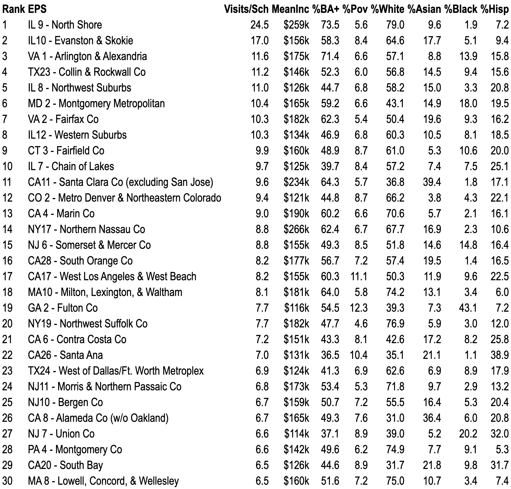
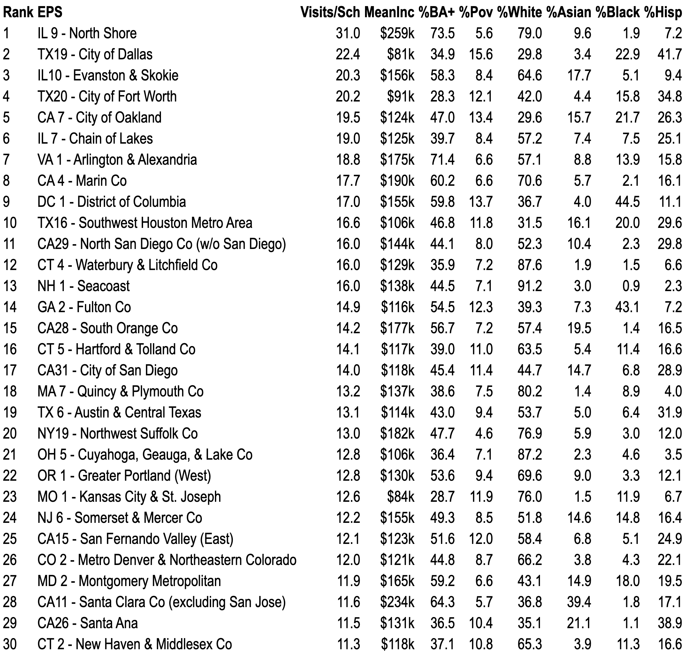

# Introduction

```{r setup, include=FALSE}
library(tidyverse)
library(kableExtra)
knitr::opts_chunk$set(echo = FALSE, message = FALSE, warning = FALSE)
```

<!-- ASKS FOR CRYSTAL

- MAKE SLIDE TITLE FONT THICKER; PROBABLY SAME FOR SUB-TITLE
- 

-->

### __Motivation__  {.hide}

Social closure

- Privileged "status groups" restrict access to resources that confer privilege

Site of social closure

- Conflict over access to selective/flagship colleges

Mechanism of social closure

- Privileged groups redefine admissions criteria to benefit themselves

::: {style="margin-top:1.0em;"}
:::

Colleges don't passively accept applicants; they recruit

- If recruiting markets constructed by shared infrastructures
- Then social closure operates upstream of admissions

::: {style="margin-top:1.0em;"}
:::

This paper 

- Analyze the relationship between "Geomarkets" -- recruiting territories created by College Board -- and recruiting visits by colleges to high schools


### __Sociology of Education__
#### __How are students sorted into colleges?__

- *Annual Review of Sociology* [@RN2190; @RN4873; @RN2377; @RN5113].

  - <span style="color:#B3B3B3;">Households: status attainment, cultural capital</span>
  - <span style="color:#B3B3B3;">Schools: "sorting machines" that assign categories (e.g., tracks)</span>
  - Colleges
      - Selective admissions: which admissions criteria to ration scarce seats

::: {style="margin-top:1.0em;"}
:::

- Enrollment economy [@RN2401] and enrollment management [@RN3519]
    - High school recruiting visits [@RN4758]

::: {style="margin-top:1.0em;"}
:::

- "Supply-side" research thinks colleges are doing the sorting
- Third-party intermediaries
  - Consumer-facing intermediaries (e.g., rankings) discipline consumers and colleges [@RN5003; @RN5065]
  - Business-facing intermediaries sort students on behalf of colleges

### **Case**
#### **The Structure of College Choice [@RN4982]**

::: {style="margin-top:1.0em;"}
:::

Creates three geographic levels: region, state, community (Geomarket)

- Geomarkets carve states and metro areas into smaller geographic regions

::: {style="margin-top:1.0em;"}
:::

Create 4 student "market segments" based on SAT score-sending behavior

- local, in-state, regional, national
- local: send most scores to colleges within Geomarket
- regional: send most scores out-of-state but in-region (e.g., Midwest)

::: {style="margin-top:1.0em;"}
:::

Market Segment Model predicts how demand for a college varies by Geomarket

- Student market segment mostly a function of class
- Selective colleges primarily enroll "regional" and "national" students
- Most "regional" and "national" students are located in affluent Geomarkets
- Selective colleges should focus recruiting on affluent Geomarkets
  
### Geomarkets around Chicago-land {.hide}

::: columns
::: {.column width="50%"}


<!--  -->
:::

::: {.column width="50%"}
**[University of Chicago admissions counselors, IL territories](https://collegeadmissions.uchicago.edu/contact)**

:::
:::


### __Theory__
#### __Market devices and classification situations__

__Market devices literature__ [@callon1998embeddedness; @RN5064]

- **Market devices**: tools that calculate/classify, then get incorporated in products
  - Geomarkets: defines recruiting territories
  - Market Segment Model: theory is abstract idea, until embedded in a device
    - Enrollment Planning Service (EPS) software

- **Agencement**: devices + org roles/goals produce menu of possible/likely actions  
  - Colleges commensurate Geomarkets based on market segments, SES, scores

- **Performativity**: Usage of devices produce behavior consistent with theory
  - Here: colleges use Geomarkets + related devices to produce recruiting behavior consistent with Market Segment Model

__Classification Situations__ [@RN4810; @RN5015]

- Ordinally ranked consumers matched to ordinally ranked products
- Market Segment Model: ordinally ranked student segments (local, in-state, regional, national) matched to ordinally ranked colleges


### __Theory__ {.hide}
#### __Research questions and expectations__

**RQ1**: Are visit patterns consistent with Market Segment Model recommendations?

- Expectation: For selective privates and most publics in sample, Market Segment Model recommends focusing on affluent Geomarkets in regions where many students likely to consider a college like yours

**RQ2**: Do Geomarkets (X) explain which high schools receive recruiting visits (Y)

- Geomarkets embedded in org + tech infrastructure that produces visits
  - Colleges assign admissions officers to Geomarkets ([LinkedIn profiles](#){data-modal-type="image" data-modal-url="./assets/images/strong_island_geomarkets_linkedin.png"})
  - Geomarkets + Market Segment Model basis for [Enrollment Planning Service](#){data-modal-type="image" data-modal-url="./assets/images/eps_landing_page.png"}
    - Identifies Geomarkets with high demand for peer/competitor colleges
  - Geomarkets integrated into [Slate/Oracle CRM software](#){data-modal-type="image" data-modal-url="./assets/images/slate_geomarket_shot.png"}

**RQ3**: Does Geomarket popularity (number of visits per school) mediate relationship between school composition (SES/race) and probability of a receiving a visit?

- Classification situations seek "good matches" between consumers and products
- A wealthy school in a wealthy Geomarket is a good match

# Methods

### __Data and sample__

Data collection [@RN4758]

- 2017 off-campus recruiting visits scraped from univ admissions websites

Data collection sample

- Public "research-extensive" universities from 2000 Carnegie (N=102)
- Private universities in top 100 of U.S. News *National Universities* (N=57)
- Private colleges in top 50 of *National Liberal Arts Colleges* (N=47)

Analysis sample: colleges that posted complete recruiting visits on website

- 16 public research, 14 private universities, 12 private liberal arts (omitted)

Constructing Geomarkets

- Assign Census tracts to Geomarkets by spatial overlay of @RN4988


Secondary data

- IPEDS; CCD; Private School Survey; Niche *Best Public/Private High Schools*

# Results

## RQ1

### __RQ1: Do visit patterns match Market Segment Model?__
#### __Geographic origin of fall 2016 freshman enrollment__

```{r fig-fresh-enroll, echo=FALSE, results="asis", message=FALSE, warning=FALSE}
pdf_in  <- "results/fall_2016_freshman_enroll_combined_plots.pdf"
png_out <- "results/fall_2016_freshman_enroll_combined_plots.png"

if (!file.exists(png_out) || file.info(png_out)$mtime < file.info(pdf_in)$mtime) {
  if (!requireNamespace("magick", quietly = TRUE)) {
    stop("Install 'magick': install.packages('magick')")
  }
  img <- magick::image_read_pdf(pdf_in, density = 220)
  magick::image_write(img, path = png_out, format = "png")
}

cat(sprintf(
  '<p></p>',
  png_out
))
```

### RQ1: Do visit patterns match Market Segment Model?
#### Recruiting visits by Geomarket market segment

```{r fig-recruiting-heatmap-market-segment, echo=FALSE, results="asis", message=FALSE, warning=FALSE}
pdf_in  <- "results/recruiting_heatmap.pdf"
png_out <- "results/recruiting_heatmap.png"

if (!file.exists(png_out) || file.info(png_out)$mtime < file.info(pdf_in)$mtime) {
  if (!requireNamespace("magick", quietly = TRUE)) {
    stop("Install 'magick': install.packages('magick')")
  }
  img <- magick::image_read_pdf(pdf_in, density = 220)
  magick::image_write(img, path = png_out, format = "png")
}

# Must be <p></p> so your script.js click-to-modal works
cat(sprintf(
  '<p style="text-align:center;"></p>',
  png_out
))
```

### RQ1: Do visit patterns match Market Segment Model?
#### Recruiting visits by EPS region

```{r fig-recruiting-heatmap-eps-region, echo=FALSE, results="asis", message=FALSE, warning=FALSE}
pdf_in  <- "results/recruiting_heatmap_eps_region.pdf"
png_out <- "results/recruiting_heatmap_eps_region.png"

if (!file.exists(png_out) || file.info(png_out)$mtime < file.info(pdf_in)$mtime) {
  if (!requireNamespace("magick", quietly = TRUE)) {
    stop("Install 'magick': install.packages('magick')")
  }
  img <- magick::image_read_pdf(pdf_in, density = 220)
  magick::image_write(img, path = png_out, format = "png")
}

cat(sprintf(
  '<p style="text-align:center;"></p>',
  png_out
))
```

### RQ1: Do visit patterns match Market Segment Model?
#### Top 30 Geomarkets ranked by visits per school (public school visits only)

```{r tbl-top30-pub-makepng, echo=FALSE, include=FALSE, message=FALSE, warning=FALSE}
rds_in  <- "results/top30_geo_pub_sch.RDS"
png_out <- "results/top30_geo_pub_sch.png"

top30_geo_pub_sch <- readRDS(rds_in)

# Left-align first column (labels), right-align all others
align_vec <- c("l", "l", rep("r", ncol(top30_geo_pub_sch) - 2))

tbl <- top30_geo_pub_sch %>%
  kableExtra::kbl(digits = 1, caption = NULL, align = align_vec) %>%
  kableExtra::kable_classic(full_width = FALSE)

tmp_html <- tempfile(fileext = ".html")
writeLines(
  c(
    "<!doctype html><html><head><meta charset='utf-8'>",
    "<style>",
    "  body{margin:0;padding:0;background:white;}",
    "  table{margin:0 !important;}",
    "  caption{display:none !important;}",
    "  .table-caption{display:none !important;}",
    "</style>",
    "</head><body>",
    as.character(tbl),
    "</body></html>"
  ),
  tmp_html
)

if (file.exists(png_out)) unlink(png_out)

webshot2::webshot(
  url      = tmp_html,
  file     = png_out,
  selector = "table",
  zoom     = 3
)
```

<!-- Display version sized to fit slide height; still clickable for your modal -->

<p style="text-align:center;">
  
</p>

### RQ1: Do visit patterns match Market Segment Model?
#### Top 30 Geomarkets ranked by visits per school (private school visits only)

```{r tbl-top30-priv-makepng, echo=FALSE, include=FALSE, message=FALSE, warning=FALSE}
rds_in  <- "results/top30_geo_priv_sch.RDS"
png_out <- "results/top30_geo_priv_sch.png"

top30_geo_priv_sch <- readRDS(rds_in)

# Left-align first TWO columns, right-align all others
align_vec <- c("l", "l", rep("r", ncol(top30_geo_priv_sch) - 2))

tbl <- top30_geo_priv_sch %>%
  kableExtra::kbl(digits = 1, caption = NULL, align = align_vec) %>%
  kableExtra::kable_classic(full_width = FALSE)

tmp_html <- tempfile(fileext = ".html")
writeLines(
  c(
    "<!doctype html><html><head><meta charset='utf-8'>",
    "<style>",
    "  body{margin:0;padding:0;background:white;}",
    "  table{margin:0 !important;}",
    "  caption{display:none !important;}",
    "  .table-caption{display:none !important;}",
    "</style>",
    "</head><body>",
    as.character(tbl),
    "</body></html>"
  ),
  tmp_html
)

if (file.exists(png_out)) unlink(png_out)

webshot2::webshot(
  url      = tmp_html,
  file     = png_out,
  selector = "table",
  zoom     = 3
)
```

<!-- Display version sized to fit slide height; still clickable for your modal -->
<p style="text-align:center;">
  
</p>

### RQ1: Do visit patterns match Market Segment Model?
#### Concentration of recruiting visits by Geomarket affluence

```{r fig-concentration, echo=FALSE, results="asis", message=FALSE, warning=FALSE}
pdf_in  <- "results/combined_concentration_graph.pdf"
png_out <- "results/combined_concentration_graph.png"

if (!file.exists(png_out) || file.info(png_out)$mtime < file.info(pdf_in)$mtime) {
  if (!requireNamespace("magick", quietly = TRUE)) {
    stop("Install 'magick': install.packages('magick')")
  }
  img <- magick::image_read_pdf(pdf_in, density = 220)
  magick::image_write(img, path = png_out, format = "png")
}

# Wrap in <p> so your script.js pop-up works
cat(sprintf(
  '<p style="text-align:center;"></p>',
  png_out
))
```

## RQ2

## RQ3

# Discussion

### __Discussion__

UNDER CONSTRUCTION

Access to selective private colleges and public flagship universities are sites of contestation between dominant vs. challenger status groups

- Historically, selective privates are sites of social closure
- Public flagships are sites of social closure and social mobility

Mechanisms of social closure

- Admissions criteria that favor dominant status groups
- State/federal policies that favor dominant groups or challenger groups

These literatures ignore third-party market devices

- Collectively, these market devices create infrastructures that produce social closure, even without intentional action by colleges
- Infrastructures are constructed to privilege wealth over "merit"
- We should study these infrastructures

# RQ0

```{r rq0, echo=FALSE, results = 'asis', eval = TRUE}

library(tidyverse)
library(kableExtra)  # For collapse_rows() to work
library(tools)

knitr::opts_chunk$set(echo = FALSE, message = FALSE)

# Example directories
graphs_dir <- file.path(".", "results", "graphs")
tables_dir <- file.path(".", "results", "tables")

# Revised insert_figure() that does NOT print a heading
insert_figure <- function(rq, metro, graph_type, base_path = graphs_dir) {

  # We'll use 'metro' directly since it's already underscored (e.g. "los_angeles").
  fig_file  <- file.path(base_path, rq, stringr::str_c(rq, "_", metro, "_", graph_type, ".png"))
  cap_file  <- file.path(base_path, rq, stringr::str_c(rq, "_", metro, "_", graph_type, "_title.txt"))
  note_file <- file.path(base_path, rq, stringr::str_c(rq, "_", metro, "_", graph_type, "_note.txt"))

  # Print a heading/caption
  caption_text <- if (file.exists(cap_file)) readLines(cap_file, warn = FALSE) else "No Title Found"
  writeLines(paste0("#### ", caption_text))

  # Output the figure (if it exists)
  if (file.exists(fig_file)) {
    writeLines(stringr::str_c("\n"))
  } else {
    writeLines(paste("*(Missing figure file:", fig_file, ")*\n"))
  }

  # Print footnotes (if the .txt file exists)
  if (file.exists(note_file)) {
    notes_txt <- readLines(note_file, warn = FALSE)
    writeLines(
      stringr::str_c(
        "<div class=\"footnote\">",
        paste0(notes_txt, collapse = "</br>"),
        "</div>"
      )
    )
  }
}

insert_rq1_table <- function(metro) {
  table_df <- readRDS(file.path(tables_dir, str_c('rq1_table_', metro, '.rds')))
  table_df$value[is.na(table_df$value)] <- NA_real_
  
  var_order <- c(
    '% White, non-Hispanic', '% Asian, non-Hispanic', '% Black, non-Hispanic', '% Hispanic',
    '% Two+, non-Hispanic', '% NHPI, non-Hispanic', '% AIAN, non-Hispanic',
    'Median income', '% in poverty', '% with BA+'
  )
  
  race_df <- table_df %>% filter(statistic == 'sum', str_detect(variable, '^[^%]*Hispanic'), !str_detect(variable, 'API')) %>%
    group_by(eps_codename, year, statistic) %>% mutate(value = value / sum(value) * 100) %>% ungroup() %>% 
    mutate(
      variable = str_c('% ', variable),
      value = if_else((year == '1980' & str_detect(variable, 'Asian|NHPI|AIAN|Two')), NA_real_, value)
    )
  
  pov_df <- table_df %>% filter(statistic == 'sum', variable %in% c('Poverty', 'Not poverty')) %>%
    group_by(eps_codename, year, statistic) %>% mutate(value = value / sum(value) * 100) %>% ungroup() %>% 
    filter(variable == 'Poverty') %>% 
    mutate(variable = '% in poverty')
  
  edu_df <- table_df %>% filter(statistic == 'sum', variable %in% c('Less than HS', 'HS', 'Less than BA', 'BA+')) %>%
    group_by(eps_codename, year, statistic) %>% mutate(value = value / sum(value) * 100) %>% ungroup() %>% 
    filter(variable == 'BA+') %>% 
    mutate(variable = '% with BA+')
  
  table_df <- bind_rows(
    race_df, pov_df, edu_df,
    table_df %>% filter(variable %in% var_order, statistic != 'sum')
  ) %>% 
    mutate(
      statistic = factor(statistic, levels = c('sum', 'mean', 'sd', 'p25', 'p50', 'p75')),
      variable = factor(variable, levels = var_order),
      value = sprintf('%.1f', value)
    ) %>% 
    arrange(desc(year), statistic) %>% 
    pivot_wider(id_cols = c(eps_codename, variable), names_from = c(statistic, year), values_from = value) %>% 
    arrange(variable, desc(eps_codename))
  
  headings <- unique(table_df$variable)
  headings_group <- rep(nrow(table_df) / length(headings), length(headings))
  names(headings_group) <- headings
  
  kbl(table_df %>% select(-variable), escape = F, col.names = c('', rep(c('Wt. Mean', 'Mean', 'SD', 'P25', 'P50', 'P75'), 3))) %>% 
    pack_rows(index = headings_group, colnum = 1, label_row_css = '') %>% 
    add_header_above(header = c(' ' = 1, '1980' = 6, '2000' = 6, '2020' = 6))
}

# 2) Define your *underscored* metros / RQs
  metros <- c("atlanta","bay_area","boston","chicago","cleveland","dallas","dc_maryland_virginia","detroit","houston","long_island","los_angeles","miami","new_york_city","northern_new_jersey","orange_county","philadelphia","san_diego")

  #metros <- c("bay_area","chicago")
  
rqs <- c("rq1")

# For RQ1, we have two plot types: "race" and "ses"
graph_types_rq1 <- c("race", "ses")

# 3) Main loop
for (m in metros) {

  # Convert underscores -> spaces, then title case
  # But add special checks for "dc_maryland_virginia" and "bay_area"
  if (m == "dc_maryland_virginia") {
    heading_text <- "D.C., Maryland, and Virginia"
  } else if (m == "bay_area") {
    heading_text <- "Bay Area"
  } else {
    # Normal logic
    heading_text <- gsub("_", " ", m, fixed = TRUE)
    heading_text <- tools::toTitleCase(heading_text)
    heading_text <- str_c(heading_text, " area")
  }

  # Print a top-level heading for the metro area
  writeLines(str_c("## ", heading_text))

  for (rq in rqs) {
    
    # For clarity, parse out the numeric portion
    rq_num <- str_replace(string = rq, pattern = "rq", replacement = "")

    # ---------------------------------------------
    # RQ1 Logic
    # ---------------------------------------------
    if (rq == "rq1") {

      # Each metro has 2 plots: "race" & "ses"
      for (i in seq_along(graph_types_rq1)) {
        g <- graph_types_rq1[i]

        # The first RQ1 slide for a metro has a real heading;
        # subsequent ones are hidden slides (".hide")
        writeLines(str_c("### Research question ", rq_num, if_else(i == 1, "", " {.hide}")))
        insert_figure(rq = rq, metro = m, graph_type = g)
      }
      
      # Add RQ1 table
      writeLines(str_c("### Research question ", rq_num, " {.hide}"))
      writeLines(str_c("#### Racial/ethnic and socioeconomic characteristics of ", heading_text, " Geomarkets over time"))
      
      writeLines('<div class="table-wrapper freeze-pane">')
      writeLines(insert_rq1_table(m))
      writeLines('</div>')
      writeLines('<div class="footnote">Table Notes:<br>- Race/ethnicity categories not available in 1980 Census: Asian, non-Hispanic; Two+ races, non-Hispanic; NHPI, non-Hispanic; AIAN non-Hispanic<br>- Household income measured using 2024 CPI</div>')
      
      # Add RQ1 map
      writeLines(str_c("### Research question ", rq_num, " {.hide}"))
      writeLines(str_c("#### Racial/ethnic and socioeconomic characteristics of ", heading_text, " Geomarkets over time"))
      
      rq1_map <- str_c('./results/maps/rq1_map_', m, '.html')
      
      # For maps too big to push to GitHub
      if (!m %in% c("atlanta", "boston", "orange_county", "philadelphia", "san_diego")) {
        rq1_map <- paste0('https://rq1-map-', str_replace_all(m, '_', '-'), '.netlify.app')
      }
      
      writeLines(str_c('<iframe data-src="', rq1_map, '" src="about:blank" width=100% height=100% allowtransparency="true"></iframe>'))
      writeLines('<p class="fullscreen">Fullscreen</p>')
      writeLines('<div class="footnote">Figure Notes:<br>- Race/ethnicity categories not available in 1980 Census: Asian, non-Hispanic; Two+ races, non-Hispanic; NHPI, non-Hispanic; AIAN non-Hispanic<br>- Household income measured using 2024 CPI</div>')
    }

  } # end rq loop

} # end metros loop
```

# References

::: {#refs}
:::
