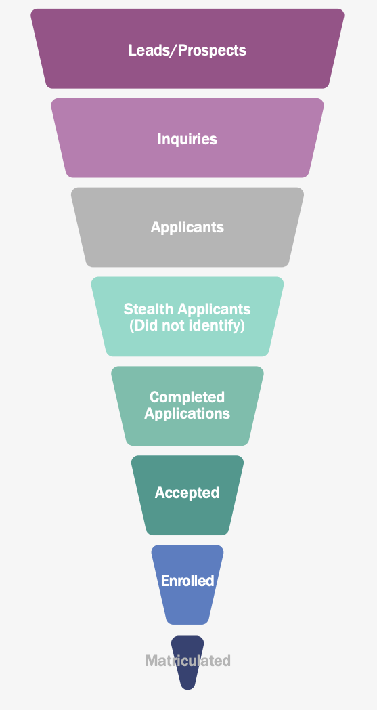

```{r setup, include=FALSE}
library(knitr)
#library(bookdown)

# https://cran.r-project.org/web/packages/kableExtra/vignettes/awesome_table_in_pdf.pdf
library(kableExtra)

#hey ho This many words: 
```

\pagenumbering{roman}
\newpage

# Resource Dependence in the Enrollment Economy

Enrollment management (EM) is simultaneously a profession, an administrative structure, and an industry. The EM profession integrates techniques from marketing and economics in order to "influence the characteristics and the size of enrolled student bodies" [@RN2771, p. xiv]. As an administrative structure, offices of EM increasingly control and coordinate the functional activities of admissions, financial aid, and recruiting [@RN2406]. The enrollment management industry incorporates relevant actors in the organizational field, including colleges, professional associations (e.g., National Association for College Admission Counseling), and third-party servicers that supply products and consulting solutions to colleges (e.g., College Board, EAB).

We utilize an oldie-but-goodie, resource dependence theory (RDT) [@RN959], to describe power dynamics between actors in the EM industry. RDT builds on Emerson's [@RN960] canonical definition of dependence: Actor $A$ depends on actor $B$ to the extent that $B$ controls goals that are valued by $A$ and cannot be fulfilled outside the $A-B$ relationship. @RN959 apply this concept to the organizational context. All organizations depend on resources from the external environment to survive and thrive. An external resource provider has power over a focal organization to the extent that (1) the resource is essential for organizational operations, (2) few alternative sources of the resource exist, and (3) the external organization has discretion over how the resource is allocated.

[NEED TOPIC SENTENCE; MAYBE MOVE/CUT PARAGRAPH] U.S. higher education is a market-based system consisting of a mix of direct providers -- public, private nonprofit, and for-profit -- in which the federal government has historically taken a “steer, don’t row” approach, using subsidies and regulations to encourage providers to achieve government goals around college access and degree completion. Broadly, the federal government provides two sources of funding. First, federal research funding is primarily allocated to research universities. Second, federal government subsidizes higher education by providing Title IV grants and loans to students. A Title IV institution is a postsecondary institution eligible to enroll students that receive federal student aid. These funds follow students to whichever Title IV postsecondary institutions they attend. From the perspective of Title IV institutions, the competition to enroll students is akin to a voucher system.


In the case study of California adult education institutions, @RN2401[p. 332] states that "The most important pressures on these schools in their day-to-day administration arise from the *enrollment economy* [because] school income is largely determined by student attendance." @RN2401[p. 335] observes that "their central dilemma is that the short-run need for clientele, set by the enrollment economy, strains against the long-run need for educational respectability as the basis for legitimacy." 

The article "Subsidies, hierarchy and peers: The awkward economics of higher education" by @RN1549 describes dependence on students for selective colleges. He describes the production function as a "customer-input technology" in that "the technology of producing much of what is sold in higher education is unusual in that colleges can buy important inputs to their production only from the customers who buy their products" (p. 17). Not only do colleges depend on students for tuition revenue and on alumni for donation revenue, but the characteristics of enrolled students -- for example, average SAT scores -- substantially determine their national ranking, which then determines student demand for the subsequent cohort of prospects [CITE ESPELAND; BASTEDO].

We sketch the enrollment economy for our analysis sample. We include 12 selective private liberal arts colleges, including Williams (ranked \#1 liberal arts colege in 2020 USNWR) and Swarthmore (ranked \#3) at the top of the prestige hierarchy and Sewanee (ranked \#47) and Connecticut College (ranked \#51) at the bottom. The enrollment economy for selective liberal arts colleges hews most closely to the characterization of @RN1549. These institution depend primarily on revenue from tuition and donations from wealthy alumni. Their reputation in the zero-sum game for prestige is largely dependent on the high school academic achievement of the students they enroll, rather than the achievement of the faculty they employ. Increases in federal student loan maximums and the growing use of home equity lines of credit facilitated long-term growth in tuition prices and an arms race in spending on education quality and amenities amongst selective private institutions [@RN4461; @RN5066]. Given the exorbitant price of tuition and the desire to enroll students from families who will donate in the future, selective liberal arts colleges primarily enroll rich students with a modicum of students from middle- and lower-class backgrounds [@RN4722]. Selective private research universities face a similar enrollment economy, but are less dependent on students to the extent that they derive financial and reputional resources from faculty research and, for some universities. Our analysis sample includes 14 selective private research universities, with Northwestern (ranked \#9) and Notre Dame (ranked \#19) at the top and Stevens Institute of Technology (ranked \#80) and Marquette (ranked \#88) at the bottom. 


Finally, our analysis sample includes 16 public research universities, ranging from UC-Berkeley (ranked \#22), CU-Boulder (ranked \#103), to the University of Arkanas (ranked \#160). As the story goes, public research universities have historically been less beholden to the enrollment economy. Aside from federal research funding, they received stable state appropriation, block-grant funding that was only nominally tied to year-to-year changes in student enrollment. Most public research universities primarily enrolled state residents and were content to serve the missions of state development, social mobility, and training for the state's next generation of civic leaders, business leaders, and professionals [CITE]. Beginning in the 1980s, state appropriations became less certain and began to decline as a share of total revenue [@RN2271]. In response to an initial decline in resources from an important resource provider, RDT suggests that a focal organization may attempt to signal how much value they provide. @RN1095 shows how the University of Wisconsin-Madison attempted to justify and sustain public funding from the state. In the 2000s, state appropriations became increasingly volatile, declining substantially during economic downturns, but failing to fully rebound during periods of recovery [@RN2271]. In response to prolonged uncertainty or decline from an important resource provider, RDT suggests that a focal organization will attempt to redcuce dependence on the resource provider by seeking alternative resources. In-state tuition price is typically capped by state policymakers but nonresident tuition price is not, making nonresident enrollment growth an attractive substitute for state appropriations revenue. @RN3753 show that, from 2002-03 to 2012-13, a 10% decline in state appropriations was associated with a 4.6% increase in subsequent nonresident freshman enrollment. Because nonresident tuition price at public research universities is often 2-3 times higher than resident tuition price, nonresident students tend to be more affluent than resident students [@RN3685]. Long-term state disinvestment makes public research universities beholden to the enrollment economy that governs selective private institutions, pursuing national recognition in college rankings and/or intercollegiate athletics as a means of generating demand from students as customers.

Scholarship at the nexus of EM and college access can be categorized by which part(s) of the enrollment funnel it speaks to. The enrollment funnel -- shown in Figure @fig-em-funnel and based on the traditional marketing funnel -- is a conceptual model used by the EM industry to depict stages in the process of recruiting students [@RN4986; @RN2004]. The funnel begins with a large pool of "prospects" (the universe of prospective students the college would like to enroll), followed by "leads" (prospects whose contact information has been obtained), "inquiries" (prospects who contact the institution), "applicants," "admits," and "enrolled students." The funnel narrows at each successive stage in order to convey the assumption of "melt" (e.g., a subset of "inquiries" will apply). The purpose of the enrollment funnel is to inform recruiting interventions that target one or more stages. These interventions seek to increase the probability of "conversion" across stages [@RN4322]. In sociology, economics, and related interdisciplinary fields, the majority of scholarship focuses on the admissions stage -- for example, analyzing which admissions criteria are utilized and/or which applicants are admitted [e.g., @RN4874; @RN4993; @RN4131; @RN3522] -- or on financial aid leveraging as a means to convert admits to enrolled students [e.g., @RN3133; @RN3762]. For example, @RN2241 shows that from 1992 to 2003, the amount of institutional financial aid awarded on behalf of student financial need decreased relative to financial aid awarded to student academic achievement.
<!-- Whereas @RN4402 highlights the effect of recruiting visits on inquiries and enrollees, findings from @RN3519 suggest that the College may have valued recruiting visits primarily as a means of maintaining relationships with guidance counselors. From this perspective, recruiting visits may affect outcomes such as inquiries, applications, and matriculation through their effect on high school guidance counselors. -->

A growing literature in sociology analyzes the earlier "recruiting" stages of the enrollment funnel. Several monographs analyze recruiting as part of a broader study on enrollment management [@RN3519], high school to college transitions [@RN4324], elite reproduction [@RN4407], or political economy [@cottom2017lower]. 
<!-- The present manuscript -- concerned with the relationships between selective colleges and high schools -- is indebted to @RN3519, particularly the chapter "Travel," in which the author visited high schools as an admissions representative for a selective private liberal arts college. We are also indebted to @RN4321, who shows how elite private high school guidance counselors enable less-than-stellar students gain admission to prestigious colleges.-->

@RN960 states that dyadic relationships typically involve mutual dependence between actors. @RN959 stress that Organizational stability depends on maintaining a stable and predictable flow of important resources. Colleges depend on a stable flow of incoming students that collectively satisfy broad enrollment goals -- revenue, academic profile, diversity -- and the demands of internal constituents -- the biology department needs majors and the band needs players. Colleges depend on high schools to provide these students. Although a college does not depend on any single high school to provide a substantial share of enrollment, the list of schools that enroll desirable students who are interested in attending is not infinite, thereby motivating "the recruiters' emphasis on feeder high schools" [@RN4982, p. 11]. High schools want to send their students to college. This goal is particularly important at affluent public high schools and even more so at expensive private schools, which depend on their record of sending students to "good" colleges to rationalize the sticker price. However, @RN960 observes that relationships of mutual dependence are seldom symmetric. A college values a high school to the extent that they want to enroll students from that high school. A private college that depends mostly on tuition revenue may place low value on a high school that primarily enrolls low-income students. A high school values a college to the extent that they want some of their students to enroll in that college. The distribution of student achievement suggests that high schools value a range of colleges. However, colleges deemed below this range may be viewed with disdain.

@RN3519 provides an ethnography of the admissions office at a selective private liberal arts college. The College is sensitive about its position in the U.S. News Rankings, and enrollment priorities tend to focus on academic profile and revenue generation. @RN3519 highlights the relational function of off-campus recruiting visits, stating that "the College's reputation and the quality of its applicant pool are dependent upon its connections with high schools nationwide" (p. 54). Therefore, during the autumn "travel season," admissions officers visit selected high schools across the country "to spread word of the institution and maintain relationships with guidance counselors" (p. 53-54) because counselors who view a college favorably will steer students to that college. The College tended to visit the same "feeder" schools year after year because recruiting depends on long-term relationships with high schools. The high schools they visited tend to be affluent schools -- in particular, private schools -- that possess the resources to host a successful visit and enroll high-achieving students who can afford tuition. [THIS PARAGRAPH IS VERBATIM FROM RIHE]
<!-- Whereas @RN4402 highlights the effect of recruiting visits on inquiries and enrollees, findings from @RN3519 suggest that the College may have valued recruiting visits primarily as a means of maintaining relationships with guidance counselors. From this perspective, recruiting visits may affect outcomes such as inquiries, applications, and matriculation through their effect on high school guidance counselors. -->

@RN4321 analyzed recruiting from the perspective of an elite private boarding school in order to understand "how such schools continue to get comparatively under-qualified students into top colleges and universities" (p. 98). Guidance counselors at these schools capitalize on the fact that selective colleges are concerned about their acceptance and yield rates. Therefore, admissions offices value credible information about which applicants will accept or decline an admissions offer. This desire for intelligence creates an opportunity for high school counselors to advocate on behalf of their students. Guidance counselors tell admissions counselors which highly-sought-after applicants are likely to decline an offer, while lobbying for an applicant who has relatively weak academic credentials but is sure to matriculate and has "character" and extracurricular activities the university values. @RN4321 states that such horsetrading depends on guidance counselors having sufficiently small caseloads to advocate for each student individually and on having personal relationships with university admissions officers. While @RN3519 and @RN4321 highlight the importance of social networks between private schools and private universities, prior research has not analyzed the social networks that emerge from off-campus visits. [PARAGRAPH VERBATIM FROM RIHE]


, but unbalanced 


Colleges depend on a stable flow 

RDT asserts that organizations require *stable*, predictable flow of resources. This truism motivates "the recruiters' emphasis on feeder high schools" [@RN4982], those schools that yield enrolled students year after year. these are the schools that you visit no matter what. [PARAGRAPH ON STEVENS AND ON KHAN. OUTLINE IT FIRST BUDDY. LOOK AT WHAT YOU WROTE IN RIHE CUZ THAT ONE DID IT MOST]

Feeder high schools . As such, 

Zemsky observes that 


describes the author's observations serving as awhich  and also to @RN4407. 


. <!--  Applicants consist of inquiries who apply plus "stealth applicants" who do not contact the university before applying. The funnel narrows at each successive stage in order to convey the assumption of "melt" (e.g., a subset of "inquiries" will apply).  -->
THEN PARAGRAPH THAT IS ABOUT SHIFT IN RESEARCH FROM ADMISSIONS AND FINANCIAL AID TO RECRUITING. 

THEN PARAGRAPHS ABOUT RECRUITING. AND ALL THE DEPENDENCIES INVOLVED.

They receive block-grant funding from state appropriations that is nominally tied to student enrollment. 


which consists of 14 selective private research universities, 12 selective private liberal arts colleges, and 16 public research universities. 


The enrollment economy for selective research universities is similar to that of 
revenue sources are tuition and donations from alumni. 


Federal funding for higher education contributes to the enrollment economy. 
Federal financial aid increases the extent to which colleges are beholden to the enrollment economy. 

PX: DRAW FROM RDT TO DESCRIBE DEPENDENCE IN US HIGHER EDUCATION SYSTEM:

- A NATIONAL VOUCHER SYSTEM; FEDERAL GRANTS AND LOANS FOLLOW STUDENTS TO WHICHEVER INSTITUTION THEY CHOOSE TO ATTEND; 
- SOMEWHERE, MAYBE DIFFERENT PARAGRAPH, NOT JUST STUDENTS BUT A STABLE FLOW OF STUDENTS, WHICH CREATES IMPORTANCE OF FEEDER SCHOOLS; 

# Quantification and Social Reproduction

# The Case of College Board Geomarkets

# References

\singlespacing

::: {#refs}
:::

\clearpage
\singlespacing

```{r fig-em-funnel, echo = FALSE, fig.align = 'center', fig.cap = "The Enrollment Funnel", out.width = "45%"}

#knitr::include_graphics('./../../outputs/figures/enrollment_funnel.png')
#
```
